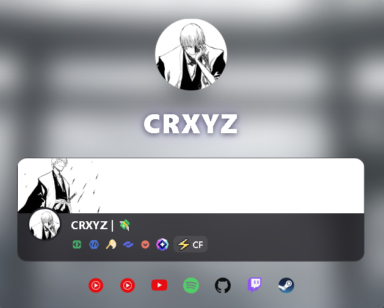
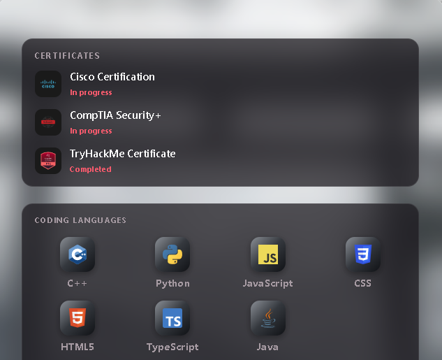
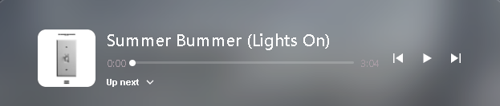

<div align="center">
# ✨ CRXYZ — Profile Page ✨
 
🖤 A guns.lol-style profile card, built from scratch with plain **HTML**, **CSS** & **JS**
🚫 No frameworks · 🚫 No build step · ⚡ Just open and go
 
</div>

 
## 📸 Preview

| Profile | Skills | Player |
|:---:|:---:|:---:|
|  |  |  |


---
 
## 🗂️ Folder structure
 
```
gunslol_site/
├── 📄 index.html          # markup only — no inline CSS or JS
├── 🎨 css/
│   └── styles.css         # all styling, incl. responsive PC layout
├── ⚙️ js/
│   └── script.js          # link config + click/keyboard wiring
├── 🖼️ screenshots/         # preview images used in this README
└── 📘 README.md
```
 
⚠️ **Keep the folders together** — `index.html`, `css/styles.css`, and `js/script.js` all reference each other by relative path, so the layout has to stay intact for the page to render.
 
---
 
## 🚀 Features
 
- 🧊 **Glass panels** — three separate frosted-glass cards: profile info, certificates/languages/tech stack, and the music player
- 💬 **Hover tooltips** — languages and the Cisco certificate status pop up a small badge on hover (proficiency level / *"studying for it right now"*)
- 🔗 **Working buttons** — the Discord card and every social icon are real, keyboard-accessible links
- 📱💻 **Responsive** — phone-sized under ~520px, becomes a centered desktop card above that
---
 
## 🔧 Editing your links
 
All outbound links live in **one place** — `js/script.js`:
 
```js
const LINKS = {
  discord:       "https://discord.com/users/REPLACE_WITH_YOUR_ID",
  youtubeMusic1: "https://music.youtube.com/channel/REPLACE_ME",
  youtubeMusic2: "https://music.youtube.com/channel/REPLACE_ME",
  youtube:       "https://youtube.com/@REPLACE_ME",
  github:        "https://github.com/REPLACE_ME",
  twitch:        "https://twitch.tv/REPLACE_ME",
  steam:         "https://steamcommunity.com/id/REPLACE_ME"
};
```
 
✏️ Just swap the placeholder URLs for your real ones — nothing else needs to change.
 
---
 
## 🖱️ How the buttons are wired
 
Any element in `index.html` tagged with `data-link="key"` gets auto-connected to `LINKS[key]`:
 
```html
<!-- index.html -->
<a class="info-card" data-link="discord" aria-label="Open Discord profile">
  ...
</a>
```
 
```js
// js/script.js
document.querySelectorAll("[data-link]").forEach((el) => {
  const key = el.getAttribute("data-link");
  const url = LINKS[key];
  if (!url) return;
 
  const open = () => window.open(url, "_blank", "noopener");
  el.addEventListener("click", open);
  el.addEventListener("keydown", (e) => {
    if (e.key === "Enter" || e.key === " ") {
      e.preventDefault();
      open();
    }
  });
});
```
 
➕ **Adding a new icon later?** Give it a `data-link="yourKey"` in the HTML, then add `yourKey: "https://..."` to `LINKS`. That's it.
 
---
 
## 💡 Hover tooltip pattern
 
Languages and the certificate status both use the same lightweight **CSS-only** tooltip — zero JS involved:
 
```css
/* css/styles.css */
.lang-chip::after{
  content:attr(data-level);
  position:absolute;
  bottom:calc(100% + 10px);
  opacity:0;
  transition:opacity .15s ease, transform .15s ease;
}
.lang-chip:hover::after{ opacity:1; }
```
 
```html
<span class="lang-chip" data-level="Fluent">English</span>
```
 
🔤 To add a language or change a level, just edit the `data-level` value.
 
---
 
## 🏃 Running locally
 
No build tools needed — just open `index.html`, or serve the folder:
 
```bash
cd gunslol_site
python3 -m http.server 8000
# 🌐 then visit http://localhost:8000
```
 
---
 
## 🌍 Deploying to GitHub Pages
 
1. 📤 Push this folder to a GitHub repo
2. ⚙️ Repo **Settings → Pages** → set source to the branch/folder containing `index.html`
3. 🎉 Your page goes live at `https://<username>.github.io/<repo-name>/`
---
 
<div align="center">
Made by **CRXYZ**
</div>